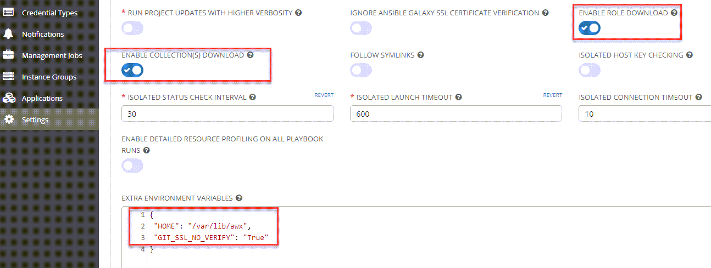
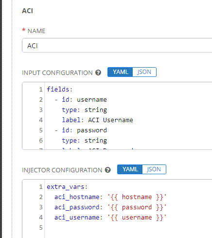
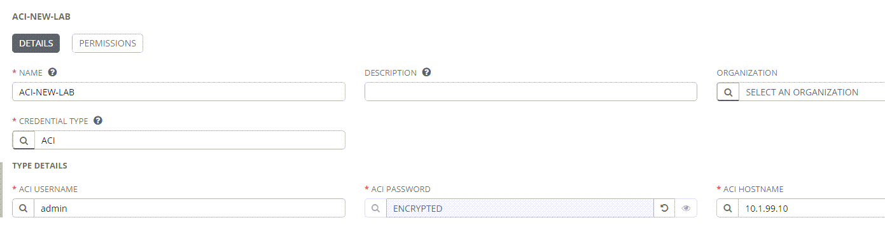
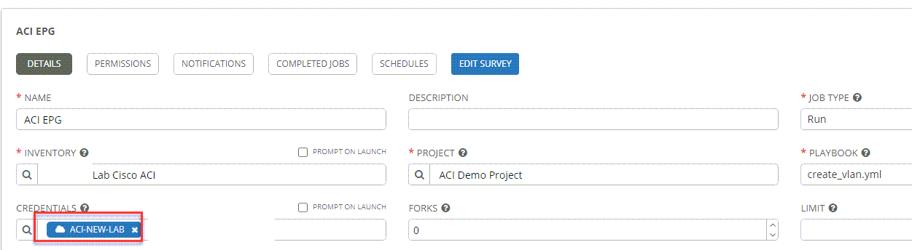

## AWX

## Installation WSL + Docker on Windows
* WSL2 Installation (need win10 + specific build)
  * See Links
* AWX as Docker

```bash
pip3 install docker docker-compose
git clone https://github.com/ansible/awx.git
cd awx
# Checkout latest tag
tag=$(git describe --tags `git rev-list --tags --max-count=1`)
git checkout tags/$tag -b $tag-branch
cd installer
ansible-playbook -i inventory install.yml
docker logs -f awx_task

# If port 80 message or something about secret_key
#  Solution: port 80 cannot be used on windows -> change to 8080
#  Modify docker-compose
cd ~/.awx/awxcompose
docker-compose down

  web:
    image: ansible/awx:16.0.0
    container_name: awx_web
    depends_on:
      - redis
      - postgres
    ports:
      - "8080:8052"

docker-compose up -d
# Verify 4 docker containers (redis, web, task, posgres) are running
docker ps

# Docker on Windows
Docker > Settings > General > Use WSL2 based engine
Docker > Settings > Resources > Configure WSL + Enable integration # Restart on change


# Login
# username:admin 
# password:password
http://localhost:8080

```

## Collections
* Are installed automatically on Project sync 
* File: collections/requirements.yml

```yml
---
collections:
  - cisco.aci
  - community.general
  - community.vmware
  - ansible.posix
  - ansible.netcommon
```

## Settings
* Settings > Jobs
  * GIT SSL Verify disable
  * Automatic Role Download
  * Automatic Collection Download



## Credentials
* Credential types define the format of a credential
* Credentials themselves use a specific format





```yml
# Input configuration example
fields:
  - id: username
    type: string
    label: ACI Username
  - id: password
    type: string
    label: ACI Password
    secret: true
  - id: hostname
    type: string
    label: ACI Hostname
required:
  - username
  - password
  - hostname

# Injector Configuratione example
extra_vars:
  aci_hostname: '{{ hostname }}'
  aci_password: '{{ password }}'
  aci_username: '{{ username }}'


```

## Links
* https://grantlittle.me/index.php/2020/06/06/installing-ansible-on-windows-subsystem-for-linux-wsl-using-ubuntu/#comment-28
* https://grantlittle.me/index.php/2020/06/08/installing-ansible-awx-on-windows-using-wsl-2-docker-desktop/
* https://docs.microsoft.com/en-us/windows/wsl/install-win10#manual-installation-steps
